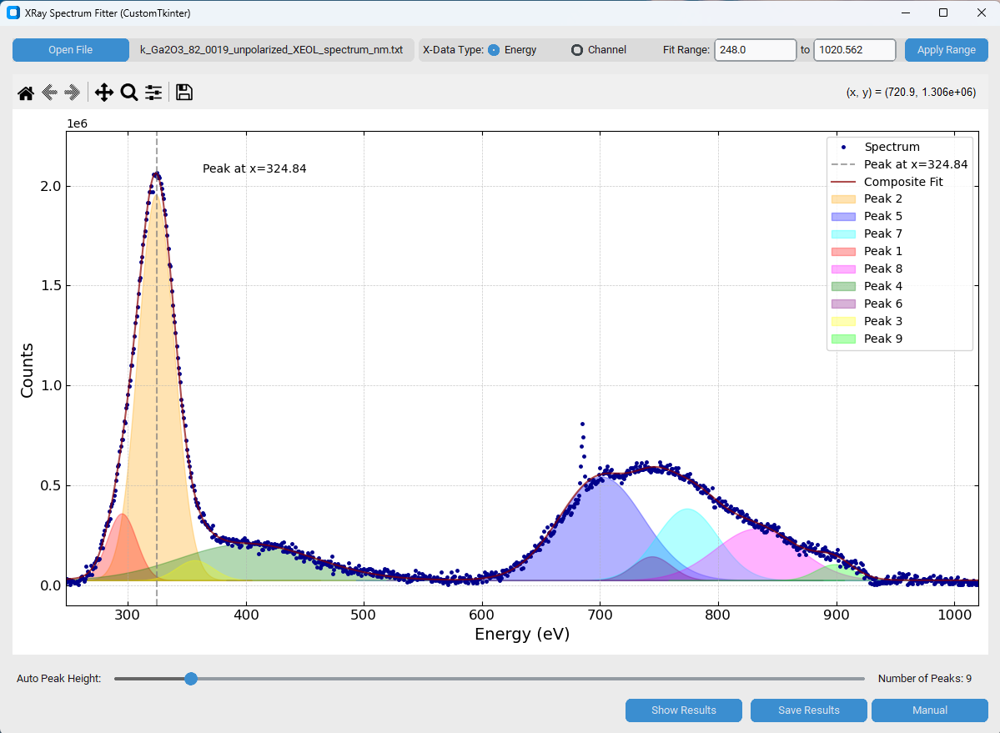

# X-Ray Spectrum Fitter

A modern, standalone GUI application built with CustomTkinter for loading, visualizing, and fitting Gaussian peaks to spectrum data. This tool is specifically designed to work with data files from applications like the **[ESRF PyMca](https://www.silx.org/pub/doc/PyMca/latest/)**, supporting its common data structures.

'

## 🚀 Features

* **Modern Interface:** Clean and theme-able UI built with `customtkinter`.
* **Data Loading:** Loads `.txt` and `.csv` files, automatically detecting common delimiters (comma, tab, whitespace).
* **PyMca-Aware:** Optimized for **[ESRF PyMca](https://www.silx.org/pub/doc/PyMca/latest/)** data. It correctly parses files with `Channel`, `Counts`, and `Energy` columns.
* **Axis Selection:** Toggle the plot's x-axis between **Channel** and **Energy** (if energy data is present).
* **Interactive Plotting:** Powered by Matplotlib, including navigation, zoom, and pan controls.
* **Automatic Fitting:**
    * Uses `scipy.signal.find_peaks` for automatic peak detection.
    * Adjust peak-finding sensitivity with a **"Auto Peak Height"** slider.
    * Performs a composite Gaussian fit for **up to 10 peaks** using `scipy.optimize.curve_fit`.
* **Manual Fitting:**
    * A **"Manual"** mode opens a new window with sliders for all fit parameters (center, width, height, baseline).
    * Visually see your manual adjustments update on the main plot in real-time.
    * **"Reset to Auto-Fit"** button to discard manual changes.
* **Export Results:**
    * **"Show Results"** button displays all fit parameters in a clean pop-up window.
    * **"Save Results"** button exports the complete fit parameters and function definitions to a `.txt` file.

## 💾 Data Format

This tool is designed to be flexible but is optimized for data from PyMca.

* **File Types:** `.txt` or `.csv`.
* **Delimiters:** Automatically detects comma (`,`), semicolon (`;`), tab, or whitespace.
* **Headers:** Automatically attempts to skip a single header line if it contains non-numeric text.
* **Column Structure:** The script expects data in the following order:
    1.  `Column 1`: **Channel**
    2.  `Column 2`: **Counts**
    3.  `Last Column`: **Energy**

**PS**: While PyMca may label last column as **Energy (eV)**, this tool can process data where this column is actually **Wavelength (nm)**.

## 🛠️ Installation & Requirements

This script requires Python 3 and the libraries listed below.

1.  **Clone the repository:**
    ```bash
    git clone [https://github.com/ocakiroglu/XRay-Spectrum-Data-Fitting.git](https://github.com/ocakiroglu/XRay-Spectrum-Data-Fitting.git)
    cd XRay-Spectrum-Data-Fitting
    ```

2.  **Create a `requirements.txt` file** in the same directory with the following content:

    ```
    customtkinter
    numpy
    scipy
    matplotlib
    ```

3.  **Set up your Python environment:**

    You can use either a standard `venv` or `conda`.

    ---
    ### Option 1: Using `venv` (standard Python)

    ```bash
    # Create a virtual environment
    python -m venv venv
    
    # Activate it
    # On Windows:
    .\venv\Scripts\activate
    # On macOS/Linux:
    source venv/bin/activate
    
    # Install libraries
    pip install -r requirements.txt
    ```
    ---
    ### Option 2: Using `conda`

    ```bash
    # Create a new conda environment (e.g., named 'spectrum_fitter')
    # We recommend Python 3.13.5 or newer
    conda create --name spectrum_fitter python=3.13.5
    
    # Activate the environment
    conda activate spectrum_fitter
    
    # Install libraries using pip (easiest way)
    pip install -r requirements.txt
    ```
    *(Note: Using `pip install -r requirements.txt` within the active conda environment is the simplest way, as `customtkinter` is not on the default conda channels.)*

## 🏃 How to Use

Activate the environment and then follow this steps:

1.  **Run the application:**
    ```bash
    python gaussian_fit_on_spectrum_GUI_modern_v3.py
    ```

2.  **Basic Workflow:**
    * Click **"Open File"** to load your `.txt` or `.csv` spectrum file.
    * Select your desired x-axis (**"Energy"** or **"Channel"**) using the radio buttons.
    * Define the area you want to fit by typing in the **"Fit Range"** boxes and pressing `Enter` or clicking **"Apply Range"**.
    * Adjust the **"Auto Peak Height"** slider until the **"Number of Peaks"** label shows the correct number of peaks for your selected range. The plot will update with an automatic fit.
    * *(Optional)* Click the **"Manual"** button to open the slider window. Adjust the parameters as needed. Your changes will appear on the main plot.
    * Click **"Show Results"** to view the final parameters or **"Save Results"** to export them to a text file.

## 📜 License

This project is licensed under the MIT License. See the `LICENSE` file for details.

## 🙏 Acknowledgments


This code was developed with coding assistance from **Google's Gemini** and **Github Copilot**.

